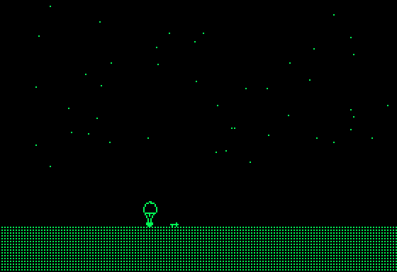
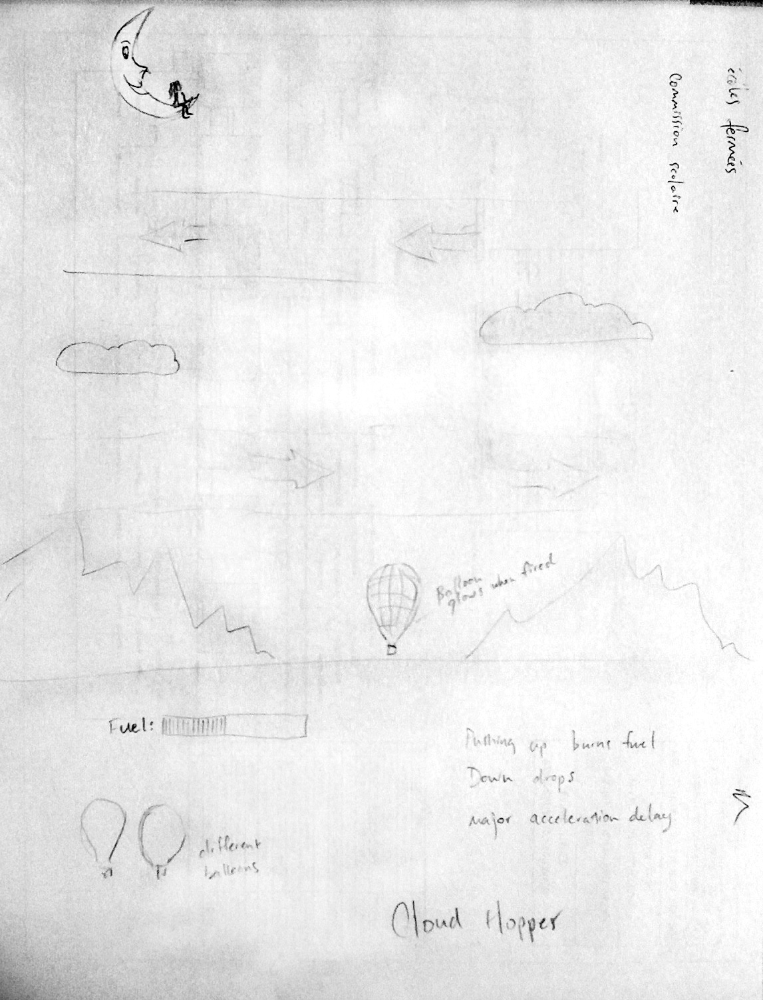

# balloon-ride-rescue
Early version of an old Apple II BASIC game

<figcaption>
Screen shots from the original Apple II. This was not the final version but is the only version whose source code survived.
</figcaption>

<figcaption>

Sketch showing the different parts of the game.
</figcaption>

#Resuce mission
The objective is to fly around from screen to screen (no scrolling backgrounds) and rescue the girl sitting in the crescent moon. Avoid the bird that appears on some screens and which will try to pierce the balloon, causing you to fall down to Earth and crash.
